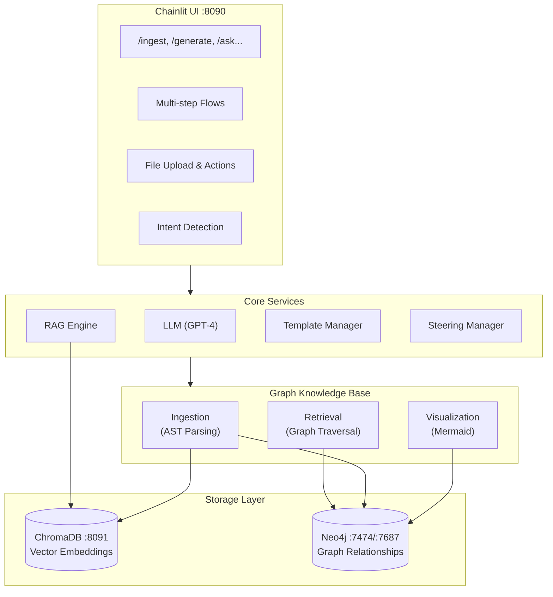

# 🚀 SA-Doc-Generator

An AI-powered documentation agent that ingests GitHub repositories and supporting documents, builds a semantic knowledge graph, and generates structured technical documentation using RAG (Retrieval-Augmented Generation).

## Overview

SA-Doc-Generator combines vector embeddings (ChromaDB) with a graph knowledge base (Neo4j) to provide deep code understanding. It can:

- Ingest and index GitHub repositories with full AST parsing
- Build relationship graphs (imports, calls, contains) for code navigation
- Answer questions about codebases with context-aware responses
- Generate technical specifications from templates
- Visualize code architecture and flows as Mermaid diagrams

The application runs as an interactive chat interface powered by Chainlit.

---

## Architecture



---

## Quick Start

### Prerequisites

- **Python 3.11+** (required for proper type hint support)
- Docker and Docker Compose
- OpenAI API key
- (Optional) GitHub token for private repositories

### 1. Clone and Configure

```bash
git clone <repo-url>
cd sa-doc-generator

# Set up environment variables
cp .env.example .env
```

Edit `.env` with your credentials:
```bash
OPENAI_API_KEY=sk-your-key-here
GITHUB_TOKEN=ghp-your-token-here  # Optional, for private repos
NEO4J_USER=neo4j
NEO4J_PASSWORD=password
```

### 2. Restore Pre-indexed Data (Optional)

If backups are available, restore the pre-indexed `REPO-NAME` codebase:

```bash
./scripts/restore_databases.sh
```

This loads vector embeddings and graph relationships so you can start querying immediately.

### 3. Start the Application

```bash
docker compose up -d
```

### 4. Access the UI

- **Chat Interface**: http://localhost:8090
- **Neo4j Browser**: http://localhost:7474 (user: neo4j, password: password)

---

## Services

| Service   | Port | Description                              |
|-----------|------|------------------------------------------|
| agent     | 8090 | Chainlit chat application                |
| chromadb  | 8091 | Vector database for embeddings           |
| neo4j     | 7474 | Graph database browser (HTTP)            |
| neo4j     | 7687 | Graph database (Bolt protocol)           |

---

## Chat Commands

### Repository Ingestion
| Command | Description |
|---------|-------------|
| `/ingest [url]` | Index a GitHub repository (dual-write to ChromaDB + Neo4j) |
| `/status [url]` | Check ingestion progress |
| `/diff [url]` | Check for repository updates |
| `/list_repos` | List all indexed repositories |

### Code Q&A
| Command | Description |
|---------|-------------|
| `/ask [question]` | Ask questions about indexed code |
| `/search [query]` | Search repository contents |
| `/architecture [repo]` | Generate architecture overview |

### Graph Visualization
| Command | Description |
|---------|-------------|
| `/visualize [repo] [type] [options]` | Generate interactive graph visualizations |
| `/graph_stats [repo]` | Display graph statistics (node/edge counts, depths) |

**Visualization Types:**
- `architecture` — Directory structure and file organization
- `calls` — Function/method call relationships
- `dependencies` — File import/dependency relationships
- `full` — Combined view of architecture, calls, and dependencies
- `comprehensive` — Single unified graph with all nodes and edges
- `call_chain` — Trace calls from/to a specific symbol
- `hotspots` — Most connected symbols (potential refactoring targets)

**Options:**
- `--symbol=<name>` — Symbol name for call_chain (required)
- `--direction=outgoing|incoming` — Call direction (default: outgoing)
- `--depth=<n>` — Max traversal depth (default: 30)
- `--limit=<n>` — Max results
- `--kinds=function,method,class` — Filter by symbol kinds

**Examples:**
```bash
/visualize my_repo calls
/visualize my_repo hotspots
/visualize my_repo call_chain --symbol=process_request
/visualize my_repo call_chain --symbol=save --direction=incoming
/visualize my_repo calls --kinds=function,method --depth=20
```

### Document Management
| Command | Description |
|---------|-------------|
| `/upload` | Upload supporting documents (PDFs, etc.) |
| `/list_docs [carrier]` | List uploaded documents |
| `/view_doc [filename]` | View document contents |
| `/delete_doc [filename]` | Delete a document |

### Generation
| Command | Description |
|---------|-------------|
| `/generate [type] [topic]` | Generate documentation from templates |
| `/prompts` | List available generation prompts |
| `/add_template` | Upload a new template |

### Steering Documents
| Command | Description |
|---------|-------------|
| `/add_steering` | Add a steering document |
| `/list_steering` | List steering documents |
| `/edit_steering [name]` | Edit a steering document |
| `/remove_steering [name]` | Remove a steering document |

### Utility
| Command | Description |
|---------|-------------|
| `/help` | Show help information |
| `/menu` | Show interactive command menu |

You can also use natural language — the intent detector will map your request to the appropriate command.

---

## Project Structure

```
sa-doc-generator/
├── src/
│   ├── app.py                 # Chainlit entry point
│   ├── context.py             # Application context (services)
│   ├── commands/              # Slash command implementations
│   │   ├── ingest.py          # /ingest, /status, /diff, /list_repos
│   │   ├── ask_code.py        # /ask, /search, /architecture
│   │   ├── generate.py        # /generate, /prompts
│   │   ├── visualize.py       # /visualize
│   │   ├── docs.py            # /upload, /list_docs, /view_doc
│   │   ├── steering.py        # Steering document commands
│   │   └── menu.py            # /menu
│   ├── core/
│   │   ├── llm.py             # OpenAI LLM wrapper
│   │   ├── rag.py             # RAG engine (retrieval + generation)
│   │   ├── embedding.py       # Embedding service
│   │   ├── template_manager.py # Jinja2 template handling
│   │   ├── steering_manager.py # Steering document management
│   │   ├── intent_detector.py  # Natural language → command mapping
│   │   └── prompt_manager.py   # Prompt template management
│   ├── graph_kb/              # Graph Knowledge Base
│   │   ├── ingestion/         # Repository ingestion (AST parsing)
│   │   ├── retrieval/         # Graph traversal and search
│   │   ├── storage/           # Neo4j and metadata stores
│   │   ├── visualization/     # Mermaid diagram generation
│   │   ├── analysis/          # Code analysis utilities
│   │   └── models/            # Data models and enums
│   ├── flows/                 # Multi-step conversation flows
│   ├── handlers/              # File upload and action handlers
│   ├── ingestion/             # Document ingestion (PDF, etc.)
│   ├── storage/               # Vector store abstractions
│   ├── steering/              # Default steering documents
│   ├── templates/             # Generation templates
│   └── utils/                 # Logging, Mermaid rendering
├── scripts/
│   ├── backup_databases.sh    # Backup ChromaDB + Neo4j
│   └── restore_databases.sh   # Restore from backups
├── config/
│   └── settings.yaml          # Application configuration
├── docker-compose.yml
├── Dockerfile.api
└── requirements.txt
```

---

## Configuration

### config/settings.yaml

```yaml
# Vector database
vector_db_path: "./chroma_db"
storage_path: "./output_docs"

# LLM
openai_model: "gpt-4o"

# Embeddings (local model)
embedding_model: "jinaai/jina-embeddings-v3"
dimensions: 1024
embedding_device: "cpu"

# Chunking
chunk_size: 1000
chunk_overlap: 200

# Graph traversal depth
max_depth: 10
```

### Environment Variables

| Variable | Required | Description |
|----------|----------|-------------|
| `OPENAI_API_KEY` | Yes | OpenAI API key for LLM |
| `GITHUB_TOKEN` | No | GitHub token for private repos |
| `NEO4J_URI` | No | Neo4j connection URI (default: bolt://neo4j:7687) |
| `NEO4J_USER` | No | Neo4j username (default: neo4j) |
| `NEO4J_PASSWORD` | No | Neo4j password (default: password) |
| `CHROMA_SERVER_HOST` | No | ChromaDB host (default: chromadb) |
| `CHROMA_SERVER_PORT` | No | ChromaDB port (default: 8000) |

---

## Database Backup & Restore

The application uses ChromaDB (vector embeddings) and Neo4j (graph knowledge base) for persistent storage. Scripts are provided to capture and restore database state.

### Creating a Backup

```bash
# Stop containers for consistent backup
docker compose down

# Create backup
./scripts/backup_databases.sh

# Restart
docker compose up -d
```

Creates timestamped archives in `./backups/`:
- `neo4j_backup_YYYYMMDD_HHMMSS.tar.gz`
- `chromadb_backup_YYYYMMDD_HHMMSS.tar.gz`
- `backup_manifest_YYYYMMDD_HHMMSS.json`

### Restoring from Backup

```bash
# Restore latest backup
./scripts/restore_databases.sh

# Restore specific backup
./scripts/restore_databases.sh --timestamp 20241226_143000

# List available backups
./scripts/restore_databases.sh --list
```

Options:
- `--latest` — Restore from latest backup (default)
- `--timestamp YYYYMMDD_HHMMSS` — Restore specific backup
- `--neo4j-only` — Only restore Neo4j
- `--chromadb-only` — Only restore ChromaDB

### Quick Start with Pre-loaded Data

```bash
# 1. Clone and configure
git clone <repo-url> && cd <repo-name>
cp .env.example .env  # Edit with your OPENAI_API_KEY

# 2. Restore databases
./scripts/restore_databases.sh

# 3. Start application
docker compose up -d
```

---

## Development

### Local Development (without Docker)

```bash
# Install dependencies
pip install -r requirements.txt

# Start Neo4j and ChromaDB separately, then:
chainlit run src/app.py -w
```

### Rebuild After Code Changes

```bash
docker compose down
docker compose up --build -d
```

### View Logs

```bash
docker compose logs -f agent
```

---

## Data Storage

### Local SQLite Databases

The application uses two local SQLite databases for metadata and state management:

| File | Purpose |
|------|---------|
| `graph_kb_metadata.db` | Graph KB ingestion state (repos, files, chunks, progress) |
| `metadata.db` | Document ingestion state |

**graph_kb_metadata.db** tracks:
- **Repository status** — which repos are indexed, their status (pending/indexing/ready/error/paused), last commit
- **File-level checkpoints** — which files within a repo have been processed (enables pause/resume)
- **Pending chunks** — chunks parsed but not yet embedded (resume from embedding phase)
- **Failed chunks** — chunks that failed embedding (can retry without re-indexing)
- **Live progress** — real-time indexing progress that persists across page refreshes

This enables:
- Pause and resume long-running ingestion jobs
- Checkpoint recovery if the process crashes mid-ingestion
- Accurate progress reporting via `/status`

### Docker Volumes

When running with Docker Compose, the main data is stored in named volumes:

| Volume | Contents |
|--------|----------|
| `chromadb_data` | Vector embeddings |
| `neo4j_data` | Graph database |
| `neo4j_logs` | Neo4j logs |
| `repo_data` | Cloned repositories |
| `hf_cache` | HuggingFace model cache |

Use the backup/restore scripts to capture and share the ChromaDB and Neo4j volumes.

---

## How It Works

### Ingestion Pipeline

1. **Clone**: Repository is cloned to local storage
2. **AST Parsing**: Python files are parsed to extract functions, classes, imports
3. **Chunking**: Code is split into semantic chunks
4. **Embedding**: Chunks are embedded using the configured model
5. **Dual Write**: 
   - ChromaDB: Vector embeddings for semantic search
   - Neo4j: Graph nodes and relationships (CALLS, IMPORTS, CONTAINS)

### Retrieval Pipeline

1. **Vector Search**: Query is embedded and matched against ChromaDB
2. **Graph Expansion**: Initial matches are expanded via Neo4j relationships (up to N hops)
3. **Ranking**: Results are ranked by vector similarity + graph distance + file bonuses
4. **Token Pruning**: Context is limited to fit LLM context window (~8000 tokens)

### Generation Pipeline

1. **Template Selection**: User selects a generation template
2. **Context Retrieval**: Relevant code/docs are retrieved via RAG
3. **Steering**: Steering documents provide additional instructions
4. **LLM Generation**: GPT-4 generates the document
5. **Output**: Markdown document saved to `output_docs/`
